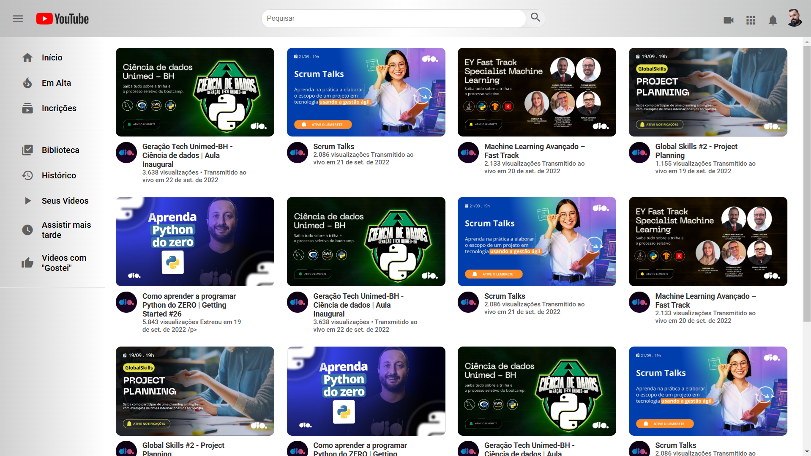

# 🎬 Projeto: Página de Listagem de Vídeos no YouTube com CSS

## 📌 Entendendo o Desafio

Neste desafio, o objetivo foi construir uma **Página de Listagem de Vídeos do YouTube** utilizando **HTML e CSS**, com foco especial na aplicação dos conceitos de **Grid Layout**.

O projeto busca simular a interface do YouTube, organizando os elementos de forma responsiva e estilizada. Além disso, essa é uma excelente oportunidade para fortalecer habilidades em **CSS moderno**, **Flexbox**, **Grid Layout**, e **estruturação de código semântico em HTML**.

Seja criativo(a) e personalize o projeto para torná-lo único! Um portfólio sólido e bem estruturado é essencial para qualquer profissional de tecnologia. 🚀

---

## 📷 Imagem do Resultado da Página feita em HTML/CSS

*Imagem da página de listagem de vídeos do YouTube criada com HTML e CSS.*

---

## 🛠️ Tecnologias Utilizadas

- **HTML5** → Para estruturação semântica da página.
- **CSS3** → Para estilização da interface.
- **CSS Grid Layout** → Para organização dos elementos na página.
- **Flexbox** → Para controle de alinhamento e espaçamento.
- **Figma** → Para design e prototipação da interface.
- **Git e GitHub** → Para versionamento e hospedagem do código.

## 🚀 Próximos Passos
🔹 Melhorar a responsividade para telas menores, como smartphones.
🔹 Adicionar JavaScript para tornar a experiência interativa (ex: reprodução de vídeos, carregamento dinâmico).
🔹 Implementar um modo escuro (dark mode) para melhorar a acessibilidade.
🔹 Adicionar animações para transições entre páginas ou elementos.
🔹 Integrar com a API do YouTube para buscar vídeos reais.
🔹 Otimizar o desempenho do CSS e HTML para carregamento mais rápido.
🔹 Adicionar testes de usabilidade e acessibilidade.

## 📝 Autor
Feito com  por Emerson Felix.

Contato:
- 📧 emerson.felix@example.com
- 🔗 LinkedIn (Substitua pelo link real do LinkedIn)
- 🐦 Twitter (Substitua pelo link real do Twitter)

🤝 Contribuição
Contribuições são bem-vindas! Se você quiser melhorar este projeto, siga os passos abaixo:

Faça um fork do projeto.
Crie uma branch para sua feature (git checkout -b feature/nova-feature).
Commit suas mudanças (git commit -m 'Adicionando nova feature').
Push para a branch (git push origin feature/nova-feature).
Abra um Pull Request.

🙌 Agradecimentos
À equipe da DIO pelo desafio inspirador.
À comunidade de desenvolvedores por compartilhar conhecimento e recursos.
Aos criadores de conteúdo que disponibilizam materiais gratuitos para aprendizado.

📌 Dicas Extras
- Teste seu projeto em diferentes navegadores (Chrome, Firefox, Edge) para garantir a consistência.
- Documente seu código para facilitar a manutenção e colaboração.